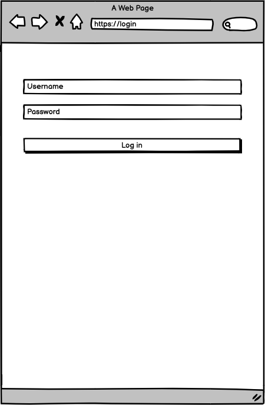

# Techiva Bloggers

<div id="top"></div>
<!-- PROJECT LOGO -->
<div align="center">
  <a href="https://github.com/fobadara/techiva-bloggers">
    
  </a>

  <h1 align="center">Techiva Bloggers</h1>

  <p align="center">
    A fully functional blogging website that shows the list of posts and empower readers to interact with them by adding comments and liking posts. 
    <br />
    <a href="https://github.com/fobadara/techiva-bloggers#readme"><strong>Explore the docs »</strong></a>
    <br />
    <br />
    <a href="https://github.com/fobadara/techiva-bloggers">View Demo</a>
    ·
    <a href="https://github.com/fobadara/techiva-bloggers/issues">Report Bug</a>
    ·
    <a href="https://github.com/fobadara/techiva-bloggers/issues">Request Feature</a>
  </p>
</div>

<!-- TABLE OF CONTENTS -->
<details>
<summary align="center">Table of Contents</summary>

- [Techiva Bloggers](#techiva-bloggers)
  - [Diagrams and Screenshots](#diagrams-and-screenshots)
    - [ERD Diagram](#erd-diagram)
    - [Wireframe](#wireframe)
  - [Description 🏗️](#description-️)
  - [Getting Started 🏁](#getting-started-)
    - [Prerequisites and Dependencies 📜](#prerequisites-and-dependencies-)
    - [Setup](#setup)
      - [Setting Up PostgreSQL](#setting-up-postgresql)
    - [Clone this repository](#clone-this-repository)
    - [Move into the directory with](#move-into-the-directory-with)
    - [Install linter](#install-linter)
    - [Create the database](#create-the-database)
    - [Install linter](#install-linter-1)
    - [Run linter](#run-linter)
      - [Auto-correct](#auto-correct)
    - [Run Project](#run-project)
    - [Usage](#usage)
    - [Roadmap](#roadmap)
  - [Built With 🔨](#built-with-)
  - [Author ✍️](#author-️)
  - [🤝 Contributors](#-contributors)
  - [📝 License](#-license)
  - [Show your support 💪](#show-your-support-)
  - [Acknowledgments](#acknowledgments)
</details>

<!-- About the project -->
[App screenshot](https://example.com)

## Diagrams and Screenshots

### ERD Diagram
<div align="center">

||||
|-|-------------|-|
||
||
</div>

### Wireframe
<!-- <div align="center"> -->



<!-- </div> -->


## Description 🏗️
This is a blogging application with validation for login and pages for users and posts.

<p align="right">(<a href="#top">back to top</a>)</p>

## Getting Started 🏁

### Prerequisites and Dependencies 📜

You will be needing:

- A terminal terminal
- A code editor
- Ruby (follow the instructions based on your OS)
  ```bash
  https://www.ruby-lang.org/en/documentation/installation/
  ```
- Rails (follow the instructions based on your OS)
    ```bash
    https://guides.rubyonrails.org/getting_started.html#creating-a-new-rails-project-installing-rails
    ```

- Postgresql (follow the instructions based on your OS)
  ```bash
  https://www.postgresql.org/download/
  ```

### Setup

#### Setting Up PostgreSQL

- The postgres installation doesn't setup a user for you, so you'll need to follow these steps to create a user with permission to create databases

  ```bash
  sudo -u postgres createuser <Username> -s
  ```

### Clone this repository

```bash
git clone https://github.com/fobadara/techiva-bloggers.git
```
### Move into the directory with

  ```bash
  cd techiva-bloggers
  ```

### Install linter

  ```bash
  bundle install
  ```
### Create the database

```bash
rails db:create
```
<div align="center">OR</div>

```bash
rake db:create
```

### Install linter

For Ruby and Rails run:
  ```bash
  bundle install
  ```

For stylelint:

  ```bash
  npm install --save-dev stylelint@13.x stylelint-scss@3.x stylelint-config-standard@21.x stylelint-csstree-validator@1.x
  ```

### Run linter
For Ruby
```bash
rubocop .
```
For Stylelint:
```bash
npx stylelint "**/*.{css,scss}"
```

#### Auto-correct

In auto-correct mode, RuboCop and stylelint will try to automatically fix offenses:

For rubocop:
```bash
rubocop -A
```
 **<div align=center>OR</div>**

```bash
rubocop --auto-correct-all
```

For stylelint:

```bash
npx stylelint "**/*.{css,scss}" --fix
```
### Run Project
```bash
rails s
```
<div align="center">OR</div>

```bash
rails server 
```
This will start a server at:
```bash
localhost:3000
```
You can paste or type it on url bar

<p align="right">(<a href="#top">back to top</a>)</p>

<!-- USAGE EXAMPLES -->
### Usage
This will be included when app is done.

<!-- ROADMAP -->
### Roadmap

- [x] Setup and controllers
- [x] Controllers specs
- [ ] Creating a data model
- [ ] Processing data in models
- [ ] Views
- [ ] Forms
- [ ] Validations, Model specs, and n+1 problems
- [ ] Add Devise
- [ ] Add authorization rules
- [ ] Integration specs for Views
- [ ] Add API endpoints
- [ ] API documentation
  
<p align="right">(<a href="#top">back to top</a>)</p>

## Built With 🔨
<div align="center">

|| Languages ||
|-|-------------|-|
||
||

</div>

<div align="center">

||Tools 🛠️||
|-|-------------|-|
||       ||
<p align="right">(<a href="#top">back to top</a>)</p>
</div>

## Author ✍️
<div align="center">

| 👤 Abdulfatai Badara  |
|---|
|<a target="_blank" href="https://github.com/fobadara"></a>  <a target="_blank" href="https://www.linkedin.com/in/fob90s"></a> <a target="_blank" href="https://twitter.com/fob90s"></a>  
<a target="_blank" href="mailto:fob90s@gmail.com"></a> <a target="_blank" href="https://wa.me/+2349066478370"> </a> 
(Click any of the badges to reach me. Especially whatsapp)|
</div>

<p align="right">(<a href="#top">back to top</a>)</p>


## 🤝 Contributors

Contributions, issues, and feature requests are greatly appreciated!

If you have a suggestion that would make this better, please fork the repo and create a pull request. You can also simply open an issue with the tag "improvements".

- Fork the Project
- Create your Feature Branch (git checkout -b feature/yourfeaturename)
- Commit your Changes (git commit -m 'Add suggested feature')
- Push to the Branch (git push origin feature/AmazingFeature)
- Open a Pull Request

Feel free to check the [issues page](https://github.com/fobadara/techiva-bloggers/issues).

<p align="right">(<a href="#top">back to top</a>)</p>

## 📝 License

This project is licensed by [](LICENSE)

## Show your support 💪
Give a ⭐️ if you like this project!

## Acknowledgments

- <a href="https://www.flaticon.com/free-icons/blog" title="blog icons">Blog icons created by Freepik - Flaticon</a>

- Hat tip to anyone whose code was used

<p align="right">(<a href="#top">back to top</a>)</p>